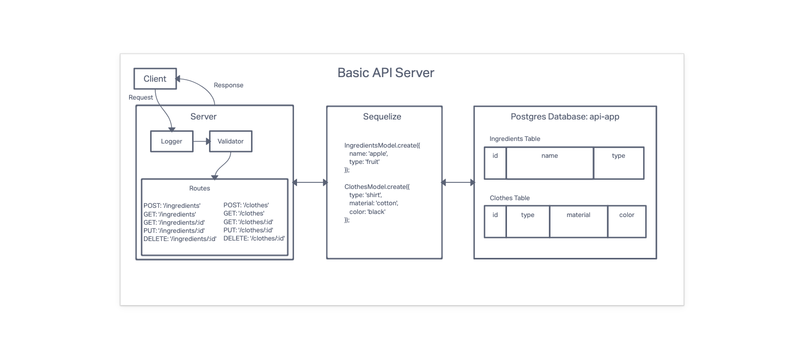

# LAB - Class 03

## Project: Basic API Server

### Author: Branden Ge

### Problem Domain

This lab demonstrates how to test an Express server, including mocking the server for testing, and testing its middleware.

- [CI/CD GitHub Actions](https://github.com/brandenge/basic-express-server/actions)
- [Back-end server url production](https://server-deployment-pract-prod.herokuapp.com/)

### Setup

`.env` Environments variables set as shown in the `.envsample`

- `PORT`
- `DATABASE_URL`

#### Running the app

- `npm start` or `nodemon` (if you have nodemon) to start the application.

#### Features / Routes

Clothes Routes

- POST : `/clothes`
- GET : `/clothes`
- GET : `/clothes/:id`
- UPDATE : `/clothes/:id`
- DELETE : `/clothes/:id`

Ingredients Routes

- POST : `/ingredients`
- GET : `/ingredients`
- GET : `/ingredients/:id`
- UPDATE : `/ingredients/:id`
- DELETE : `/ingredients/:id`

- GET : `*` - catch-all route which always responds with a 404 Not Found error.

#### Tests

- `npm test` to run tests

#### UML Diagram

Diagram created with [InVision](https://www.invisionapp.com/)

#### Credits: [Demo code from Ryan Gallaway at Code Fellows](https://github.com/codefellows/seattle-code-javascript-401d48/tree/main/class-03/inclass-demo)
